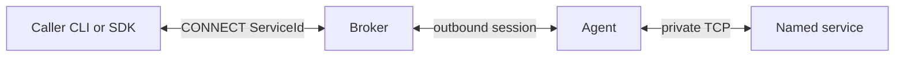

# Thirp Runtime

**Reach one named private service without opening the network around it.**

Thirp Runtime is an open-source data plane for connecting an authorized caller
to a service in a private environment. An Agent beside the private service
connects outbound to a Broker. A Caller asks for the service by logical name and
receives a bidirectional byte stream.

Thirp exposes the service—not the host, subnet, or customer network. It is not a
VPN, a general-purpose port forwarder, or an application hosting platform. The
Broker routes opaque streams by service identity; it does not interpret or
retain application payloads.



## Runtime and Cloud

Thirp Runtime and Thirp Cloud use the same data plane, but they solve different
operational problems.

| | Thirp Runtime | Thirp Cloud |
|---|---|---|
| What it is | Apache-2.0 Broker, Agent, Caller, CLI tools, Web Ingress, and embeddable SDK | Managed control plane and hosted Broker operation built on Thirp Runtime |
| Access control | Standalone Broker: static credentials and file-backed, deny-by-default policy | Managed identity, customer approval, timed grants, revocation, audit, and usage |
| Operating model | Self-hosted | Thirp-hosted |
| Availability | Public Linux operator release, multi-OS dataplane artifacts, and source; independently useful | Selective hosted pilot; not part of this repository |

The customer-side process used with Thirp Cloud is the same open-source
`thirp-agent` provided by Runtime. Runtime does not require Thirp Cloud.

Learn about the managed pilot at [thirp.net](https://thirp.net/).

## Project status

- Source version: **0.16.4**
- Wire protocol: **1.0**, frozen and documented in
  [docs/PROTOCOL.md](docs/PROTOCOL.md)
- Platforms: **Linux** (operator release), **macOS arm64**, **macOS x86_64
  (Intel)**, and **Windows AMD64** (data-plane Agent/Caller CLIs and C ABI
  shared libraries). One download:
  [v0.16.4](https://github.com/thirp/runtime/releases/tag/v0.16.4).
- SDKs: Odin source packages and one embed SDK tarball whose `c/lib/` holds
  `libthirp.so` (linux-x86_64), `libthirp.dylib` (darwin-arm64 and
  darwin-x86_64), and `libthirp.dll` (windows-amd64).
- Release artifacts on `v0.16.4` are archives:
  - Linux operator, attached by `scripts/publish_github.sh --release`:
    `thirp-runtime-linux-x86_64-0.16.4.tar.gz` (`thirp-broker`, `thirp-agent`,
    `thirp-connect`, `thirp-web-ingress`, `libthirp.so`, the Broker tarball,
    source archive, SBOM, checksums, and provenance)
  - Embed SDK and data-plane archives, attached by the `dataplane-release`
    workflow on that same tag: `thirp-runtime-sdk-0.16.4.tar.gz`,
    `thirp-runtime-macos-arm64-0.16.4.tar.gz`,
    `thirp-runtime-macos-x86_64-0.16.4.tar.gz`, and
    `thirp-runtime-windows-AMD64-0.16.4.zip`. Apple Developer ID and
    Authenticode are not claimed until those certificates are present at
    build time.

The self-hosted Runtime implements TLS, role separation, deny-by-default
production policy, bounded resources, reconnect, health/metrics, and graceful
drain. The 24-hour soak has not been run. Some qualification work is documented
at ([OPERATIONS.md](docs/OPERATIONS.md#resource-limits)). Web
Ingress has additional edge-facing limitations described in the
[security model](docs/SECURITY.md).

Broker / Web Ingress / full operator stacks remain **Linux-primary** in the
published operator Release. Dataplane Agent/Caller binaries on macOS and Windows
are produced by `scripts/release_macos.sh` / `scripts/release_windows.ps1` and
the green `dataplane-release` GitHub Actions workflow; they connect outbound to
a Linux broker over TLS. Do not treat Gatekeeper or SmartScreen warnings as
authenticity proofs until OS-level signing lands; see
[Building](docs/BUILDING.md#macos-and-windows-data-plane-release) and
[SECURITY.md](docs/SECURITY.md#release-signing).

## What is included

| Component | Purpose |
|---|---|
| [`thirp-broker`](broker_cli/README.md) | Authenticates peers, authorizes named-service operations, and relays streams |
| [`thirp-agent`](agent_cli/README.md) | Connects outbound, registers one or more services, and relays to private TCP targets |
| [`thirp-connect`](caller_cli/README.md) | Exposes an authorized service on a loopback port for existing tools |
| [`thirp-web-ingress`](web_ingress_cli/README.md) | Makes an explicitly routed HTTP/HTTPS service reachable by an unmodified browser |
| [Odin and C SDKs](docs/SDK.md) | Embed Agent or Caller behavior directly in an application |

`thirp-echo` and `thirp-echo-http` are local test fixtures, not installed
products.

## Try it locally

The supported local walkthrough uses TLS and exercises the complete path:

```text
curl → thirp-connect → thirp-broker ← thirp-agent → private HTTP service
```

It downloads three Linux binaries—or builds them from source—creates a loopback
certificate, starts each component, and sends an HTTP request through the relay.

**Start here: [Local TLS quickstart](docs/QUICKSTART.md).**

Download published archives from
[v0.16.4](https://github.com/thirp/runtime/releases/tag/v0.16.4).
The Linux operator archive includes `thirp-web-ingress` and the Broker
collection. The SDK tarball and the macOS and Windows data-plane archives are
attached by GitHub Actions. Checksums are inside each archive. To
compile individual components, or to produce a platform release tree, see
[Building, testing, and packaging](docs/BUILDING.md).

## How authorization works

A successful connection requires three separate facts:

1. An authenticated Agent owns the requested `ServiceId`.
2. An authenticated Caller has permission to connect to that exact service or
   an explicitly granted namespace.
3. The Agent can reach the configured local target.

Knowing a service name is not permission. Agent credentials can register but
cannot connect; Caller credentials can connect but cannot register. Production
policy is deny-by-default.

Runtime policy is intentionally local and file-backed. A replaceable Broker
authenticator and authorizer allow a managed control plane—such as Thirp
Cloud—to supply dynamic identity, approval, grant, and revocation decisions
without changing protocol 1.0.

See the [production walkthrough](docs/OPERATIONS.md#production-walkthrough) for
separate least-privilege credentials and exact service grants.

## Operating characteristics

- Agent and Caller sessions reconnect after transient Broker loss.
- Service registrations return when an Agent reconnects.
- In-flight streams do **not** survive a disconnect or Broker restart.
- Revocation, grant expiry, and authorization-lease expiry terminate affected
  live streams when supplied by the active authorizer.
- The Broker relays opaque bytes and records control/connection metadata, not
  application payloads.
- A self-hosted deployment uses one Broker process; high availability and
  cross-Broker handoff are not implemented in this repository.

For configuration, TLS, resource limits, metrics, systemd, containers, upgrades,
and failure triage, use the [operations guide](docs/OPERATIONS.md). Compatibility
and restart behavior are defined in [docs/COMPATIBILITY.md](docs/COMPATIBILITY.md).

## Embed Runtime

Applications can host and dial services without spawning the command-line
tools:

- Odin applications import `thirp:agent` and `thirp:caller` (all platforms).
- C applications link the shared library `libthirp.so` (Linux), `libthirp.dylib`
  (macOS), or `libthirp.dll` (Windows) through `thirp.h`.
- Hosted Broker implementations can consume the Broker Odin collection and
  provide their own authenticator and authorizer.
- Ephemeral hosting can generate a short join code for use cases such as
  peer-hosted games. A join code identifies a service; it is not a credential.

The supported API surface, lifecycle, examples, artifact layouts, and C link
instructions are in [docs/SDK.md](docs/SDK.md).

## Documentation

| If you want to… | Read |
|---|---|
| Run the local TLS relay | [Quickstart](docs/QUICKSTART.md) |
| Build, test, or package Runtime | [Building](docs/BUILDING.md) |
| Deploy a self-hosted Broker and Agents | [Operations](docs/OPERATIONS.md) |
| Embed Agent or Caller behavior | [SDK](docs/SDK.md) |
| Evaluate security boundaries and residual risk | [Security](docs/SECURITY.md) |
| Understand wire behavior | [Protocol](docs/PROTOCOL.md) |
| Check protocol, config, SDK, or C ABI compatibility | [Compatibility](docs/COMPATIBILITY.md) |
| Review user-visible changes | [Changelog](docs/CHANGELOG.md) |
| Configure a specific command | [Broker](broker_cli/README.md), [Agent](agent_cli/README.md), [Connect](caller_cli/README.md), or [Web Ingress](web_ingress_cli/README.md) |

Additional project references:

- [Dependencies](docs/DEPENDENCIES.md)
- [Odin naming conventions](docs/NAMING.md)
- [Trademark notice](docs/TRADEMARKS.md)

## Security

Report vulnerabilities to `security@thirp.net`. Do not open a public issue for
an unfixed vulnerability. See [docs/SECURITY.md](docs/SECURITY.md) for the
self-hosted threat model and release-signing key.

## Project history

Version 0.16.0 renamed the project from Rendez to Thirp Runtime. Wire protocol
1.0 did not change, but command names, source imports, configuration paths,
metrics, release artifacts, and the C ABI did. See
[docs/CHANGELOG.md](docs/CHANGELOG.md#0160) for the migration details.

## License

Apache-2.0. See [LICENSE](LICENSE) and [NOTICE](NOTICE).
